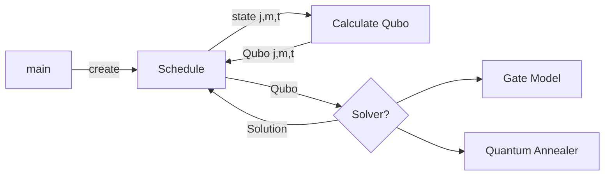

# Verwendung
Die Verwendung wird anschaulich in Beispielen erklärt in den einzelnen Notebooks und der Source-Code ist gut dokumentiert.

## Aufbau

```mermaid
graph LR
    A[main] -->|create| B[Schedule]
    B --> |state j,m,t|G[Calculate Qubo]
    G --> |Qubo j,m,t| B
    B --> |Qubo| C{Solver?}
    C --> D[Gate Model]
    C --> E[Quantum Annealer]
    C --> |Solution| B

```
