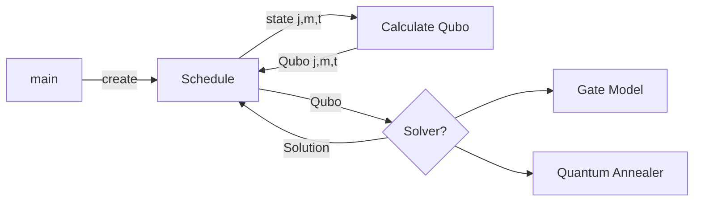

# Verwendung
Die Verwendung wird anschaulich in Beispielen erklärt in den einzelnen Notebooks und der Source-Code ist gut dokumentiert.

### Notbooks
Die Verwendung wird anschaulich in Beispielen erklärt in den einzelnen Notebooks und der Source-Code ist gut dokumentiert.
### Klassen
#### job.py
Dataklassen für Jobs und Maschinen
#### schedule.py
Schedule ist die Datenklasse, welche den gesammten Ablauf von Maschinen und Jobs speichert.
Der Schedule wird an die Quboklasse übergeben, welche mit qubo.calculate_qubo die Qubo-Matrix erzeugt.

#### lab_runner.py und anneal_solver
Sind Hilfsklassen für den Zugriff auf die Quantencomputer und das Loggen von Antworten

#### qubo_calc.py
Berechnet die einzelnen Matrixelemente der Qubomatrix
## Aufbau

